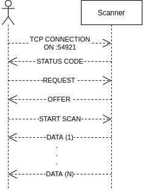

# Brother MFC-J430W WiFi scanner protocol

## Reasons

_Brother MFC-J430W has already scanner driver and you can download [here](https://support.brother.com/g/b/downloadtop.aspx?c=it&lang=it&prod=mfcj430w_all)_ **but that are prebuilt binary (x86/x64) and source code isn't public**. This is a problem if you want to use the scanner on ARM architecture, because if you don't have the source code of the driver you can't recompile it. Anyway this should work on every scanner that use `brscan4`, but I'm not sure.

## Scanner protocol



### Status codes

When we open a connection with the scanner on port 54921, it respond with his status code:

- `+OK 200`: Ready to use
- `-NG 401`: Scanner is busy

### Lease

Now we can send a request that specify resolution and color mode, then scanner send to client a offer based on request.
I called this part `lease because it recalled me _DHCP lease_

#### REQUEST

```go
request := []byte(fmt.Sprintf("\x1bI\nR=%d,%d\nM=%s\n\x80", resolution, resolution, mode))
sendPacket(socket, request)
```

#### RESPONSE

`300,300,2,209,2480,294,3472`

##### (X,Y)

- `response[0]` `response[1]`: Image DPI
- `response[3]` `response[5]`: Plane dimensions in _mm_
- `response[4]` `response[6]`: Image resolution in _px_

##### COLOR MODES

- **GRAY64**: gray scale image
- **CGRAY**: color image
- **TEXT**: low resolution mode, **max output (304x434)** [not implemented]

##### RESOLUTIONS

- 100
- 150
- 300
- 600
- 1200
- 2400

### Automatic document feeder

If specified **it's possible** to disable ADF and **scan only one page**.
Omit this if you want use ADF.

```go
if !adf {
  request = []byte("\x1bD\nADF\n\x80")
  sendPacket(socket, request)
  readPacket(socket)
}
```

## Start scan

Now we are ready to send start scan request:

```go
width = mmToPixels(planeWidth, dpiX)
height = mmToPixels(planeHeight, dpiY)

requestFormat := "\x1bX\nR=%v,%v\nM=%s\nC=%s\nJ=MID\nB=50\nN=50\nA=0,0,%d,%d\n\x80"
request = []byte(fmt.Sprintf(requestFormat, dpiX, dpiY, mode, compression, width, height))
```

- **R** = `X_DPI`, `Y_DPI`
- **M** = `CGRAY` or `GRAY64`
- **C** = `JPEG` or `RLENGTH` or `NONE`
- **J** = MID
- **B** = 50 (Brightness?)
- **N** = 50 (Contrast?)
- **A** = 0,0,`WIDTH`, `HEIGHT`

**NOTE**: `WIDTH` and `HEIGHT` are calculated from plane dimensions because _width_ received from response in [lease phase](#lease) is different from _width calculated_

```go
func mmToPixels(mm int, dpi int) int {
      return int(float64(mm*dpi) / 25.4)
}
```

Documentation work in progress...

## Compile

```bash
git clone https://github.com/v0lp3/mfc-j430w.git
go build -o mfc-j430w mfc-j430w/src/*.go
```

## Usage

```bash
./mfc-j430w --help
```

Output:

```bash
Usage of ./mfc-j430w:
  -a string
        IP address of the Brother scanner (default "192.168.0.157")
  -c string
        Color mode of the scan (CGRAY, GRAY64) (default "CGRAY")
  -m    Enable scan of all pages from feeder
  -n string
        Name of the output file (default "scan.jpg")
  -r int
        Resolution of the scan (default 300)
```

## To do

- [ ] Implement multi page scan for ADF
- [ ] Add flag to output compressed image

## Credits

[Andrea Maugeri](https://github.com/v0lp3)

Partially thanks to [this](https://github.com/davidar/mfc7400c/)
